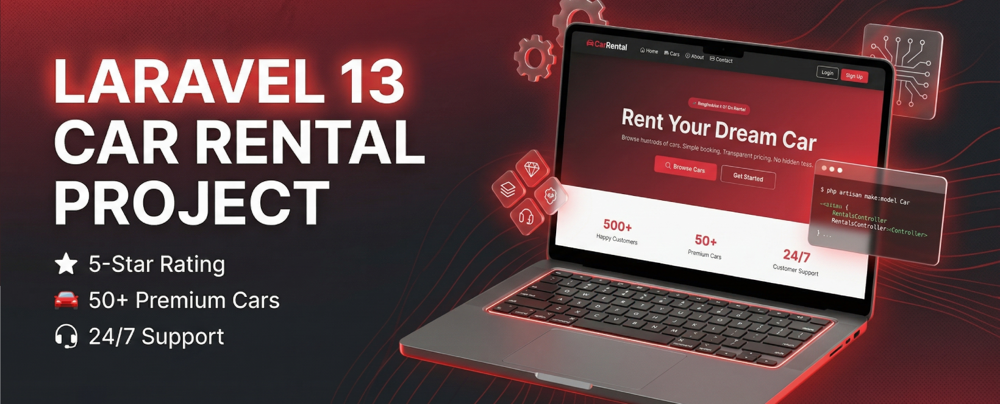

# Car Rental BD - Laravel Assignment

## Project Presentation Video

[](https://www.youtube.com/watch?v=tVsQQPxZRYQ)

> **Car Rental Web Application** built with Laravel 13

---

## Database link

👉 [ClickME](database/CarRental.sql)

---

## Features

### Admin Dashboard (`/admin/dashboard`)

- Overview stats: Total cars, available cars, total rentals, total earnings
- Manage Cars - Add / Edit / Delete cars with image upload
- Manage Rentals - Full CRUD with status management (Ongoing / Completed / Canceled)
- Manage Customers - View, edit, delete customer profiles + rental history

### Frontend (User Interface)

- Home, About, Contact pages
- Browse & filter cars by type, brand, and price
- Book a car with date selection + live cost calculator
- My Bookings - view & cancel upcoming rentals
- Register / Login / Logout

### Technical

- Email notifications on booking (to customer + admin)
- Role-based access control (admin / customer)
- Car image upload & storage

---

## Setup

```bash
# 1. Install dependencies
composer install

# 2. Copy env and set DB credentials
cp .env.example .env
# Edit DB_DATABASE, DB_USERNAME, DB_PASSWORD in .env

# 3. Generate app key
php artisan key:generate

# 4. Run migrations & seed
php artisan migrate:fresh --seed

# 5. Create storage symlink
php artisan storage:link

# 6. Serve
php artisan serve
```

---

## Login Credentials

| Role     | Email               | Password |
| -------- | ------------------- | -------- |
| Admin    | admin@rental.com    | password |
| Customer | customer@rental.com | password |
